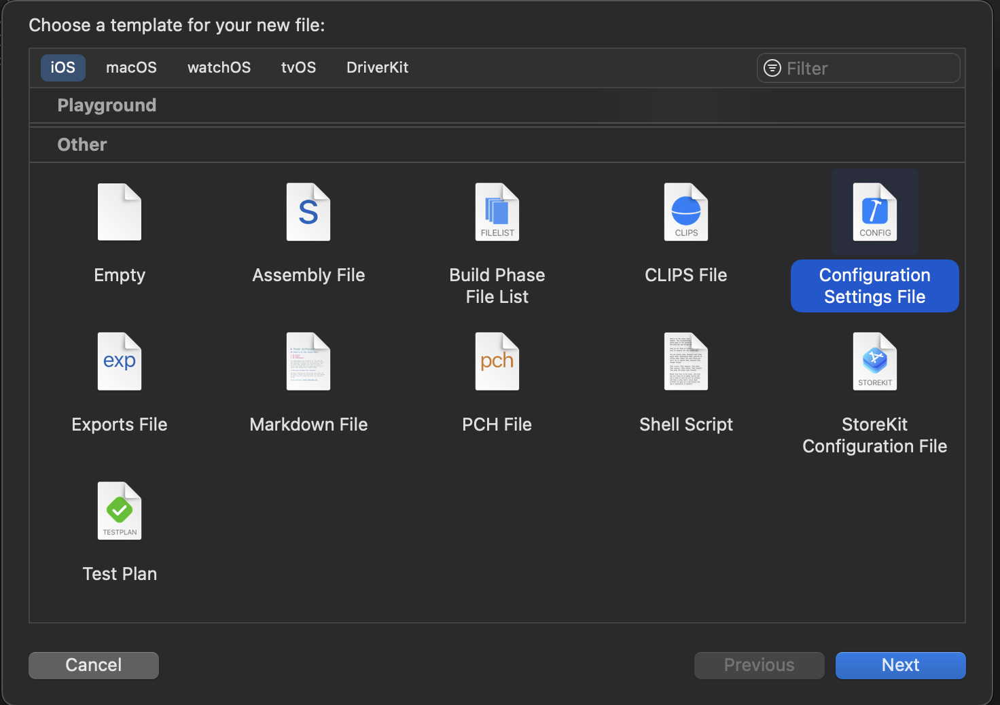
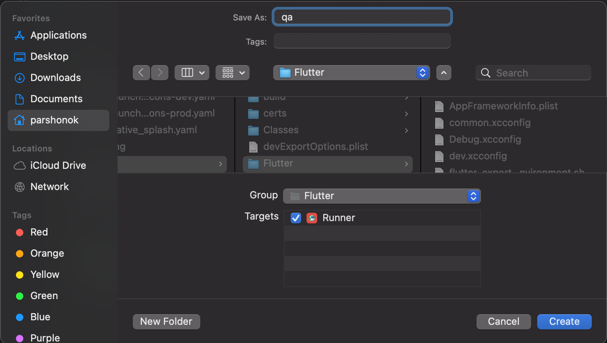
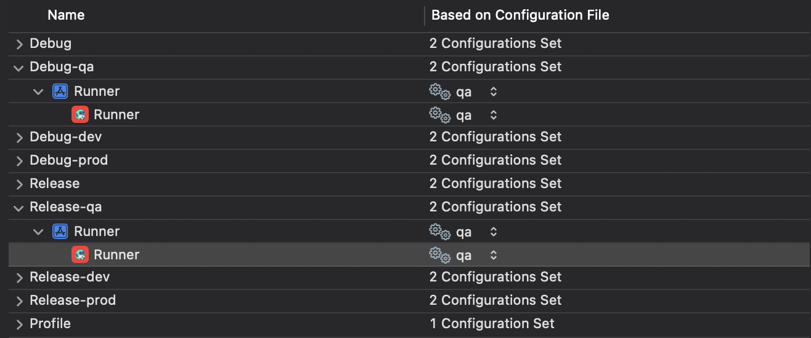
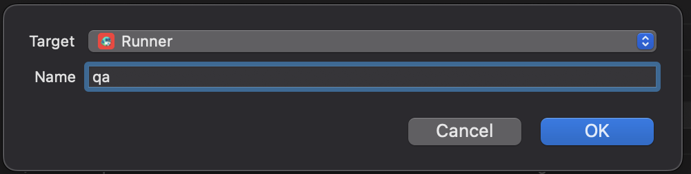
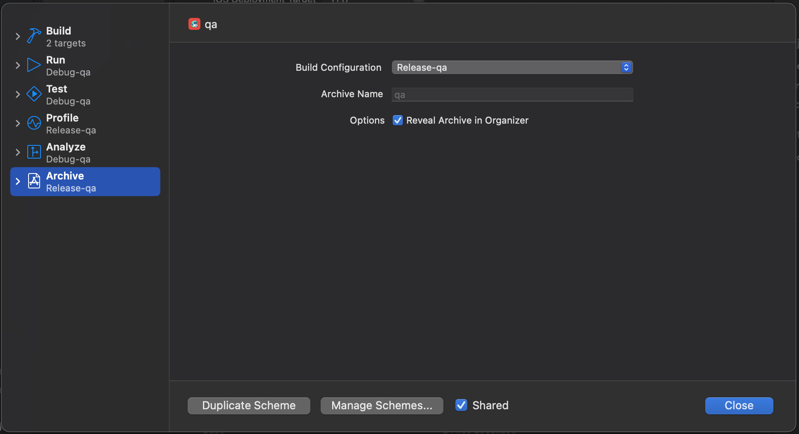

# Тип сборки(спасибо Surf за идею)

## Android

Чтобы добавить новый тип сборки, необходимо открыть [android/app/build.gradle](../android/app/build.gradle) и найти следующий код:

```gradle
flavorDimensions "release-type"

productFlavors {
    dev {
        dimension "release-type"
        applicationIdSuffix ".dev"
        versionNameSuffix "-dev"
    }
    prod {
        dimension "release-type"
    }
}
```

Далее вы можете просто добавить свой тип данных в секцию `productFlavors`.

Также вы можете специально создать директорию для вашего типа сборки в `android/app/src` директории.

## iOS

1. Откройте `Runner.xcworkspace` в Xcode.


2. Создайте новый файл конфигурации в `ios/Flutter` и назовите его как ваш тип сборки.


3. Скопируйте код ниже в ваш файл конфигурации.

> ```objc
> #include "Pods/Target Support Files/Pods-Runner/Pods-Runner.dev.xcconfig"
> #include "Generated.xcconfig"
> #include "common.xcconfig"
> 
> app_icon_suffix=-dev
> bundle_suffix=.dev
> IDENTIFIER=$(identifier)$(bundle_suffix)
> APP_ICON=$(app_icon)$(app_icon_suffix)
> ```

Замените `dev` на ваш тип сборки.

4. Перейдите в `Runner -> Project -> Runner -> Info` и продублируйте настройки(Debug, Release, Profile) в ваш новый тип сборки. Не забывайте ставить постфикс равные названию вашего типа сборки.


5. Перейдите в  `Product -> Scheme -> New scheme...` и создайте новую схему. Убедитесь, что в качестве цели выбран `Runner`.


6. Перейдите в `Product -> Scheme -> Edit scheme...` и выберите  нужный тип сборки.


## Настройка иконок приложения

Вы также можете настроить специальные иконки для вашего типа сборки. Для этого вы должны создать `flutter_launcher_icons-{your_flavor_name}.yaml`.
Например, `flutter_launcher_icons-dev.yaml`. Там вы настраиваете пути к инонкам, цветам и другим опциям для вашего типа сборки. Больше про настройку иконок приложения [здесь](./launcher_icons.md).