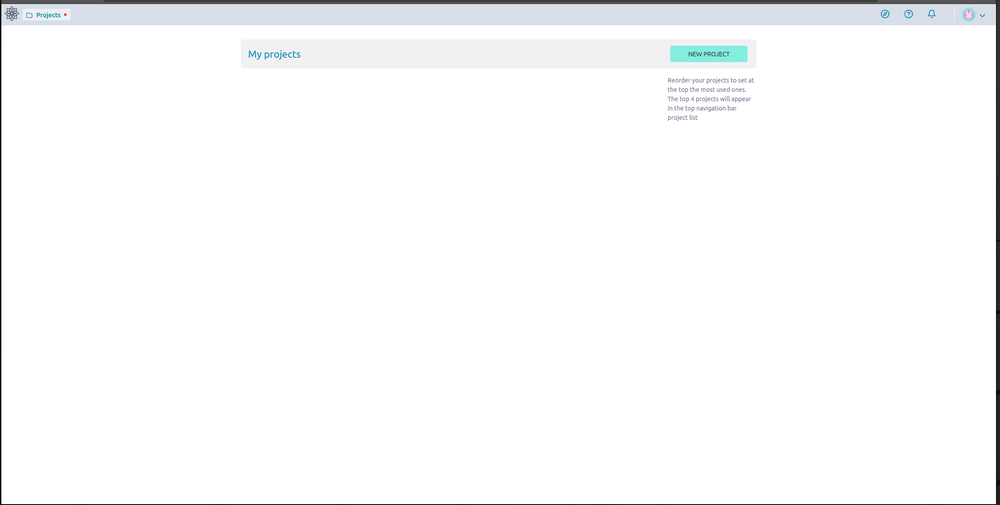

# Taiga IO



TaigaIO - это self-hosted решение, которое является альтернативой для Jira.

Особенности:

- Встроенный [penpot](https://penpot.app), который является аналогом Figma.
- Бесплатное решение, основанное на open-source технологиях.
- Быстрое развертывание.
- Богатый функционал, который почти не уступает Figma.
- Легкая настройка через `.env` файлы.

## Установка Taiga

### Установка Docker Engine(Ubuntu)

```bash
# Добавляем официальный GPG ключ для Docker:
sudo apt-get update
sudo apt-get install ca-certificates curl
sudo install -m 0755 -d /etc/apt/keyrings
sudo curl -fsSL https://download.docker.com/linux/ubuntu/gpg -o /etc/apt/keyrings/docker.asc
sudo chmod a+r /etc/apt/keyrings/docker.asc

# Добавляем apt-репозиторий в sources.list:
echo \
"deb [arch=$(dpkg --print-architecture) signed-by=/etc/apt/keyrings/docker.asc] https://download.docker.com/linux/ubuntu \
  $(. /etc/os-release && echo "$VERSION_CODENAME") stable" | \
  sudo tee /etc/apt/sources.list.d/docker.list > /dev/null
sudo apt-get update

# Установка Docker
sudo apt-get install docker-ce docker-ce-cli containerd.io docker-buildx-plugin docker-compose-plugin
```

### Клонирование репозитория taigo.io на сервер

```bash
git clone https://github.com/taigaio/taiga-docker
git checkout stable
sudo ./launch-all.sh
```

### Создание супер-пользователя

```bash
sudo ./taiga-manage.sh createsuperuser
```